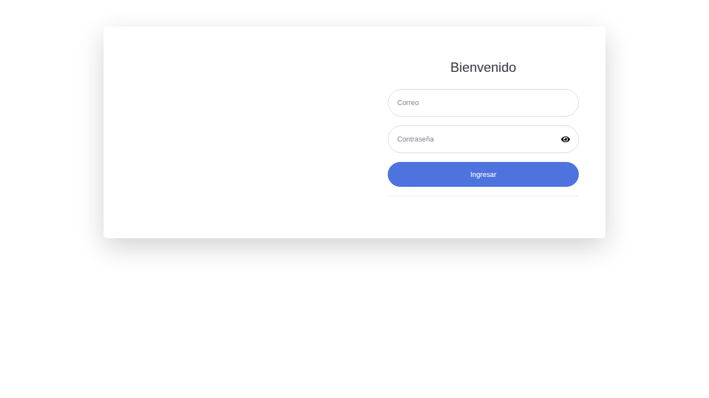

# Sistema de Ferretería "La Unión"

Sistema integral de gestión para ferretería desarrollado con ASP.NET Core 8.0 y React. Permite administrar productos, categorías, proveedores, usuarios, ventas y generar reportes.

## 📋 Tabla de Contenidos

- [Descripción del Sistema](#descripción-del-sistema)
- [Características Principales](#características-principales)
- [Arquitectura del Sistema](#arquitectura-del-sistema)
- [Base de Datos](#base-de-datos)
- [Requerimientos del Sistema](#requerimientos-del-sistema)
- [Instalación](#instalación)
- [Configuración](#configuración)
- [Despliegue](#despliegue)
- [Uso del Sistema](#uso-del-sistema)
- [Capturas de Pantalla](#capturas-de-pantalla)
- [Credenciales de Prueba](#credenciales-de-prueba)
- [Tecnologías Utilizadas](#tecnologías-utilizadas)
- [Contribución](#contribución)

## 🏪 Descripción del Sistema

El Sistema de Ferretería "La Unión" es una aplicación web completa diseñada para automatizar y gestionar las operaciones diarias de una ferretería. El sistema permite un control integral del inventario, ventas, proveedores y usuarios con diferentes niveles de acceso.

### Funcionalidades Principales:
- **Gestión de Inventario**: Control completo de productos, categorías y stock
- **Gestión de Proveedores**: Administración de información de proveedores
- **Sistema de Ventas**: Procesamiento de ventas con generación de facturas
- **Control de Usuarios**: Sistema de roles y permisos
- **Reportes y Análisis**: Dashboard con métricas y reportes de ventas
- **Historial de Transacciones**: Seguimiento completo de todas las operaciones

## ✨ Características Principales

### Para Administradores:
- Dashboard con métricas y gráficos en tiempo real
- Gestión completa de usuarios y roles
- Administración de productos, categorías y proveedores
- Acceso a todos los reportes y estadísticas
- Control de inventario y stock

### Para Usuarios de Ventas:
- Procesamiento de ventas
- Consulta de productos y precios
- Generación de facturas
- Historial de ventas

### Características Técnicas:
- Interfaz responsiva compatible con dispositivos móviles
- Conexión en tiempo real con SignalR
- Autenticación y autorización segura
- Validación de datos en frontend y backend
- Impresión de facturas y reportes

## 🏗️ Arquitectura del Sistema

### Backend (ASP.NET Core 8.0)
```
├── Controllers/           # Controladores de API
├── Models/               # Modelos de datos y DTOs
├── Services/             # Lógica de negocio
├── Repositories/         # Acceso a datos
├── Hubs/                # SignalR Hubs
└── Interfaces/          # Contratos e interfaces
```

### Frontend (React)
```
ClientApp/
├── public/             # Archivos estáticos
├── src/
│   ├── componentes/    # Componentes reutilizables
│   │   ├── NavBar.js   # Barra de navegación
│   │   ├── ConnectionStatus.js # Estado de SignalR
│   │   └── VerificarUsuario.js # Verificación de permisos
│   ├── views/          # Páginas principales
│   │   ├── Login.js    # Pantalla de inicio de sesión
│   │   ├── DashBoard.js # Panel de control
│   │   ├── Inicio.js   # Página de inicio
│   │   ├── Usuario.js  # Gestión de usuarios
│   │   ├── Producto.js # Gestión de productos
│   │   ├── Categoria.js # Gestión de categorías
│   │   ├── Proveedor.js # Gestión de proveedores
│   │   ├── Venta.js    # Nueva venta
│   │   ├── HistorialVenta.js # Historial de ventas
│   │   ├── ReporteVenta.js   # Reportes
│   │   └── NotFound.js # Página de error 404
│   ├── context/        # Context API (estado global)
│   │   ├── UserProvider.js   # Contexto de usuario
│   │   └── SignalRProvider.js # Contexto de SignalR
│   ├── services/       # Servicios de API
│   └── utils/          # Utilidades
├── package.json        # Dependencias de Node.js
└── package-lock.json   # Lock file de dependencias
```

### Estructura Completa del Proyecto:
```
FerreteriaSystem/
├── Controllers/        # Controladores de API REST
│   ├── CategoriaController.cs
│   ├── ProductoController.cs
│   ├── ProveedorController.cs
│   ├── UsuarioController.cs
│   ├── VentaController.cs
│   ├── SessionController.cs
│   └── UtilidadController.cs
├── Models/            # Modelos de datos
│   ├── DTO/          # Data Transfer Objects
│   ├── Usuario.cs
│   ├── Producto.cs
│   ├── Categoria.cs
│   ├── Proveedor.cs
│   ├── Venta.cs
│   ├── DetalleVenta.cs
│   └── DBREACT_VENTAContext.cs # Contexto de Entity Framework
├── Services/          # Servicios de negocio
├── Repositories/      # Repositorios de acceso a datos
├── Interfaces/        # Contratos e interfaces
├── Hubs/             # SignalR Hubs para tiempo real
├── ClientApp/        # Aplicación React (frontend)
├── consultas/        # Scripts de base de datos
│   └── database.sql  # Script de creación de BD
├── Properties/       # Configuración del proyecto
├── wwwroot/         # Archivos estáticos del servidor
├── appsettings.json # Configuración de la aplicación
├── Program.cs       # Punto de entrada de la aplicación
└── ReactVentas.csproj # Archivo de proyecto .NET
```

## 🗃️ Base de Datos

El sistema utiliza SQL Server con la siguiente estructura:

### Tablas Principales:

#### 1. **Rol**
- `idRol` (int, PK) - Identificador único del rol
- `descripcion` (varchar(100)) - Nombre del rol (Administrador, Vendedor)
- `esActivo` (bit) - Estado del rol
- `fechaRegistro` (datetime) - Fecha de creación

#### 2. **Usuario**
- `idUsuario` (int, PK) - Identificador único del usuario
- `nombre` (varchar(80)) - Nombre completo del usuario
- `correo` (varchar(80), UNIQUE) - Email del usuario (login)
- `telefono` (varchar(40)) - Teléfono de contacto
- `idRol` (int, FK) - Referencia al rol
- `clave` (varchar(200)) - Contraseña encriptada
- `esActivo` (bit) - Estado del usuario

#### 3. **Categoria**
- `idCategoria` (int, PK) - Identificador único de la categoría
- `descripcion` (varchar(80)) - Nombre de la categoría
- `esActivo` (bit) - Estado de la categoría
- `fechaRegistro` (datetime) - Fecha de creación

#### 4. **Proveedor**
- `idProveedor` (int, PK) - Identificador único del proveedor
- `nombre` (varchar(100)) - Nombre del proveedor
- `correo` (varchar(100)) - Email del proveedor
- `telefono` (varchar(40)) - Teléfono del proveedor
- `esActivo` (bit) - Estado del proveedor
- `fechaRegistro` (datetime) - Fecha de registro

#### 5. **Producto**
- `idProducto` (int, PK) - Identificador único del producto
- `codigo` (varchar(100), UNIQUE) - Código único del producto
- `marca` (varchar(100)) - Marca del producto
- `descripcion` (varchar(200)) - Descripción del producto
- `idCategoria` (int, FK) - Referencia a la categoría
- `idProveedor` (int, FK) - Referencia al proveedor
- `stock` (int) - Cantidad disponible
- `precio` (decimal(10,2)) - Precio de venta
- `esActivo` (bit) - Estado del producto
- `fechaRegistro` (datetime) - Fecha de registro

#### 6. **Venta**
- `idVenta` (int, PK) - Identificador único de la venta
- `numeroDocumento` (varchar(40)) - Número de factura
- `tipoDocumento` (varchar(50)) - Tipo de documento
- `fechaRegistro` (datetime) - Fecha de la venta
- `idUsuario` (int, FK) - Usuario que realizó la venta
- `documentoCliente` (varchar(40)) - Documento del cliente
- `nombreCliente` (varchar(100)) - Nombre del cliente
- `subTotal` (decimal(10,2)) - Subtotal de la venta
- `impuestoTotal` (decimal(10,2)) - Total de impuestos
- `total` (decimal(10,2)) - Total de la venta

#### 7. **DetalleVenta**
- `idDetalleVenta` (int, PK) - Identificador único del detalle
- `idVenta` (int, FK) - Referencia a la venta
- `idProducto` (int, FK) - Referencia al producto
- `cantidad` (int) - Cantidad vendida
- `precio` (decimal(10,2)) - Precio unitario
- `total` (decimal(10,2)) - Total del item

#### 8. **NumeroDocumento**
- `id` (int, PK) - Número de documento
- `fechaRegistro` (datetime) - Fecha de generación

### Relaciones:
- Usuario → Rol (Muchos a Uno)
- Producto → Categoria (Muchos a Uno)
- Producto → Proveedor (Muchos a Uno)
- Venta → Usuario (Muchos a Uno)
- DetalleVenta → Venta (Muchos a Uno)
- DetalleVenta → Producto (Muchos a Uno)

## 🔧 Requerimientos del Sistema

### Software Necesario:
- **.NET 8.0 SDK** - Framework de desarrollo backend
- **Node.js** (versión 16 o superior) - Para el frontend React
- **SQL Server** - Base de datos (puede ser SQL Server Express, LocalDB o instancia completa)
- **Visual Studio 2022** o **VS Code** - IDE recomendado
- **Git** - Control de versiones

### Hardware Mínimo:
- **Procesador**: Intel i3 o AMD equivalente
- **Memoria RAM**: 4 GB mínimo (8 GB recomendado)
- **Espacio en Disco**: 1 GB para el proyecto
- **Conexión a Internet**: Para dependencias y actualizaciones

### Navegadores Compatibles:
- Chrome 90+
- Firefox 88+
- Safari 14+
- Edge 90+

## 🚀 Inicio Rápido

¿Quieres probar el sistema rápidamente? Sigue estos pasos:

### Opción 1: Usar el Sistema en Línea (Recomendado)
1. Visita: [Sistema en Somee](http://ferreteriasystem.somee.com)
2. Usa las credenciales de prueba:
   - **Email**: `victorR@gmail.com`
   - **Contraseña**: `123`
3. ¡Explora todas las funcionalidades!

### Opción 2: Instalación Local (5 minutos)
```bash
# 1. Clonar el repositorio
git clone https://github.com/Gaitan19/FerreteriaSystem.git
cd FerreteriaSystem

# 2. Restaurar dependencias
dotnet restore
cd ClientApp && npm install && cd ..

# 3. Configurar base de datos (opcional - usar Somee)
# Editar appsettings.json si quieres usar BD local

# 4. Ejecutar el proyecto
dotnet run

# 5. Abrir http://localhost:5145 en tu navegador
```

### Primeros Pasos en el Sistema:
1. **Iniciar Sesión**: Usa las credenciales de prueba
2. **Explorar Dashboard**: Revisa las métricas generales (solo Admin)
3. **Ver Productos**: Navega a Inventario → Productos
4. **Crear una Venta**: Ve a Ventas → Nueva Venta
5. **Ver Historial**: Consulta Ventas → Historial Venta
6. **Generar Reportes**: Accede a Reportes (solo Admin)

## 📦 Instalación

### 1. Clonar el Repositorio
```bash
git clone https://github.com/Gaitan19/FerreteriaSystem.git
cd FerreteriaSystem
```

### 2. Configurar la Base de Datos
```sql
-- Ejecutar el script de base de datos
-- Archivo: consultas/database.sql
```

### 3. Instalar Dependencias del Backend
```bash
# En la raíz del proyecto
dotnet restore
```

### 4. Instalar Dependencias del Frontend
```bash
# Navegar a la carpeta del cliente
cd ClientApp
npm install
```

### 5. Configurar Connection String
Editar `appsettings.json`:
```json
{
  "ConnectionStrings": {
    "cadenaSQL": "Server=.;Database=DBREACT_VENTA;Trusted_Connection=True;MultipleActiveResultSets=true;TrustServerCertificate=True;"
  }
}
```

## ⚙️ Configuración

### Configuración de Base de Datos Local:
1. Instalar SQL Server o SQL Server Express
2. Ejecutar el script `consultas/database.sql`
3. Crear datos iniciales (roles, usuario administrador)
4. Actualizar la cadena de conexión en `appsettings.json`

### Configuración de Desarrollo:
```bash
# Ejecutar el proyecto
dotnet run
```
El sistema estará disponible en: `http://localhost:5145` o `https://localhost:7145`

### Variables de Entorno (Opcional):
```bash
ASPNETCORE_ENVIRONMENT=Development
ASPNETCORE_URLS=http://localhost:5145
```

## 🚀 Despliegue

### Despliegue Local:
```bash
# Compilar para producción
dotnet publish -c Release

# Ejecutar
dotnet ./bin/Release/net8.0/publish/ReactVentas.dll
```

### Despliegue en Hosting (Somee.com):
El sistema está configurado para usar hosting gratuito de Somee:

1. **Base de Datos**: Utiliza SQL Server en Somee
2. **Configuración**: 
   ```json
   "cadenaSQL": "workstation id=DBREACT_VENTA.mssql.somee.com;packet size=4096;user id=vhromero_SQLLogin_1;pwd=m5zmtmub73;data source=DBREACT_VENTA.mssql.somee.com;persist security info=False;initial catalog=DBREACT_VENTA;TrustServerCertificate=True"
   ```
3. **URL del Sistema**: [Sistema en Somee](http://ferreteriasystem.somee.com)

### Otros Hostings:
- **Azure App Service**
- **AWS Elastic Beanstalk**  
- **Google Cloud Platform**
- **IIS Server** (Windows Server)

## 💻 Uso del Sistema

### Inicio de Sesión:
1. Acceder a la página principal
2. Ingresar credenciales (email y contraseña)
3. El sistema redirige según el rol del usuario

### Navegación:
- **Sidebar**: Menú principal con módulos del sistema
- **Topbar**: Información del usuario y logout
- **Breadcrumbs**: Navegación contextual

### Módulos Principales:

#### 📊 Dashboard (Solo Administradores)
- Métricas generales del sistema
- Gráficos de ventas por período
- Productos más vendidos
- Indicadores clave de rendimiento

#### 👥 Gestión de Usuarios (Solo Administradores)
- Crear, editar y eliminar usuarios
- Asignar roles y permisos
- Activar/desactivar cuentas
- Cambio de contraseñas

#### 📦 Gestión de Inventario
**Productos:**
- Agregar nuevos productos
- Editar información de productos
- Control de stock
- Precios y categorías

**Categorías:**
- Crear categorías de productos
- Organizar inventario
- Activar/desactivar categorías

**Proveedores:**
- Registrar proveedores
- Información de contacto
- Historial de suministros

#### 💰 Módulo de Ventas
**Nueva Venta:**
- Selección de productos
- Cálculo automático de totales
- Información del cliente
- Generación de factura

**Historial de Ventas:**
- Consulta de ventas anteriores
- Filtros por fecha y usuario
- Detalles de transacciones
- Reimpresión de facturas

#### 📈 Reportes
- Reportes de ventas por período
- Análisis de productos más vendidos
- Reportes de inventario
- Exportación a Excel/PDF

## 📱 Capturas de Pantalla

### Pantalla de Login


*Pantalla de inicio de sesión con validación de credenciales. Permite el acceso al sistema mediante email y contraseña. Incluye validación de campos y mensajes de error informativos.*

### Dashboard Principal (Administrador)
[Ver Dashboard Completo](screenshots/dashboard_mock.html)

*Panel principal que muestra métricas clave del sistema:*
- **Cantidad total de ventas**: Número de transacciones procesadas
- **Ingresos generados**: Total de ingresos por ventas
- **Total de productos**: Inventario disponible
- **Número de categorías**: Organización del inventario
- **Gráficos interactivos**: Ventas por período y productos más vendidos
- **Indicadores en tiempo real**: Métricas actualizadas automáticamente

### Gestión de Productos
[Ver Módulo de Productos](screenshots/productos_screen.html)

*Módulo completo para administrar el inventario:*
- **Lista de productos**: Tabla con todos los productos registrados
- **Búsqueda y filtros**: Localización rápida de productos
- **Información detallada**: Código, marca, descripción, categoría, proveedor
- **Control de stock**: Visualización de cantidades disponibles
- **Estados**: Productos activos/inactivos con indicadores visuales
- **Precios**: Gestión de precios de venta
- **Acciones**: Editar, eliminar productos con confirmaciones

### Módulo de Ventas
[Ver Proceso de Venta](screenshots/ventas_screen.html)

*Procesamiento completo de ventas:*
- **Información del cliente**: Captura de datos del comprador
- **Búsqueda de productos**: Localización rápida por código o descripción
- **Carrito de compras**: Productos seleccionados con cantidades
- **Cálculos automáticos**: Subtotales, impuestos y total
- **Tipos de documento**: Facturas o tickets según necesidad
- **Validaciones**: Control de stock y datos requeridos
- **Procesamiento**: Generación inmediata de comprobantes

### Características Visuales del Sistema:
- **Diseño responsivo**: Compatible con dispositivos móviles y tablets
- **Interfaz intuitiva**: Navegación clara y fácil de usar
- **Indicadores visuales**: Estados, alertas y notificaciones claras
- **Tablas interactivas**: Ordenamiento, filtrado y paginación
- **Formularios validados**: Entrada de datos con validación en tiempo real
- **Gráficos dinámicos**: Visualización de datos con Chart.js
- **Impresión optimizada**: Facturas y reportes listos para imprimir

### Funcionalidades Adicionales Mostradas:
- **Gestión de categorías**: Organización del inventario por tipos
- **Administración de proveedores**: Información de contacto y suministros
- **Control de usuarios**: Roles, permisos y estados de cuentas
- **Historial de transacciones**: Consulta de ventas anteriores con detalles
- **Reportes personalizados**: Análisis de ventas por períodos y productos
- **Estados del sistema**: Conexión en tiempo real con SignalR

### Navegación del Sistema:
- **Sidebar responsivo**: Menú principal con iconografía clara
- **Breadcrumbs**: Navegación contextual para ubicación
- **Dropdown de usuario**: Perfil y opciones de sesión
- **Notificaciones**: Alertas y confirmaciones con SweetAlert2

## 🔐 Credenciales de Prueba

Para probar el sistema, utiliza las siguientes credenciales:

```
Email: victorR@gmail.com
Contraseña: 123
```

**Nota**: Este usuario tiene permisos de administrador, por lo que tendrá acceso a todas las funcionalidades del sistema.

### Roles en el Sistema:
- **Administrador**: Acceso completo a todos los módulos
- **Vendedor**: Acceso limitado a ventas y consultas

## 🛠️ Tecnologías Utilizadas

### Backend:
- **ASP.NET Core 8.0** - Framework web
- **Entity Framework Core** - ORM para base de datos
- **SQL Server** - Sistema de gestión de base de datos
- **SignalR** - Comunicación en tiempo real
- **BCrypt.Net** - Encriptación de contraseñas

### Frontend:
- **React 18** - Biblioteca de interfaz de usuario
- **React Router** - Navegación SPA
- **Reactstrap/Bootstrap** - Framework de CSS
- **Chart.js** - Gráficos y visualizaciones
- **SweetAlert2** - Alertas y notificaciones
- **React-to-Print** - Impresión de documentos

### Dependencias Principales:
```json
{
  "react": "^18.2.0",
  "react-router-dom": "^6.3.0",
  "reactstrap": "^8.9.0",
  "bootstrap": "^4.6.0",
  "react-chartjs-2": "^4.2.0",
  "sweetalert2": "^11.4.19",
  "react-to-print": "^2.15.1",
  "@microsoft/signalr": "^8.0.7"
}
```

### Herramientas de Desarrollo:
- **Visual Studio 2022** / **VS Code**
- **Git** - Control de versiones
- **npm** - Gestor de paquetes
- **Postman** - Testing de APIs

## 🤝 Contribución

Para contribuir al proyecto:

1. Fork el repositorio
2. Crear una rama para tu feature (`git checkout -b feature/AmazingFeature`)
3. Commit tus cambios (`git commit -m 'Add some AmazingFeature'`)
4. Push a la rama (`git push origin feature/AmazingFeature`)
5. Abrir un Pull Request

### Estándares de Código:
- Seguir convenciones de C# y JavaScript
- Documentar funciones complejas
- Incluir pruebas unitarias cuando sea posible
- Mantener código limpio y legible

### Reportar Bugs:
- Usar el sistema de Issues de GitHub
- Incluir pasos para reproducir el error
- Especificar entorno y versión del navegador

## 🔧 Solución de Problemas

### Problemas Comunes:

#### Error de Conexión a Base de Datos:
```
Microsoft.Data.SqlClient.SqlException: A network-related or instance-specific error occurred
```
**Solución**: Verificar que SQL Server esté ejecutándose y la cadena de conexión sea correcta.

#### Error al Iniciar la Aplicación React:
```
Module not found: Error: Cannot resolve...
```
**Solución**: 
```bash
cd ClientApp
rm -rf node_modules package-lock.json
npm install
```

#### Error de Autenticación:
**Problema**: No se puede iniciar sesión con credenciales válidas.
**Solución**: Verificar que el usuario exista en la base de datos y esté activo.

#### Puerto en Uso:
**Problema**: `Error: EADDRINUSE: address already in use`
**Solución**: Cambiar el puerto en `launchSettings.json` o detener el proceso que usa el puerto.

### Comandos Útiles:

```bash
# Limpiar y reconstruir el proyecto
dotnet clean
dotnet build

# Actualizar dependencias de React
cd ClientApp
npm update

# Verificar estado del proyecto
dotnet --info
node --version
npm --version

# Ejecutar migraciones de base de datos (si se usan)
dotnet ef database update
```

### Logs del Sistema:
- **Backend**: Los logs se muestran en la consola al ejecutar `dotnet run`
- **Frontend**: Los logs aparecen en la consola del navegador (F12)
- **Base de Datos**: Revisar los logs de SQL Server

## 📞 Soporte y Contacto

Para obtener ayuda adicional:

1. **Documentación**: Revisar este README.md
2. **Issues**: Crear un issue en GitHub con detalles del problema
3. **Logs**: Incluir logs relevantes al reportar problemas
4. **Entorno**: Especificar versiones de .NET, Node.js y navegador

### Información del Sistema:
- **Plataforma**: Multiplataforma (Windows, macOS, Linux)
- **Base de Datos**: SQL Server 2016 o superior
- **Navegadores**: Chrome 90+, Firefox 88+, Safari 14+, Edge 90+

---

**Desarrollado por**: Equipo de Desarrollo Ferretería La Unión  
**Versión**: 1.0.0  
**Licencia**: MIT  
**Última Actualización**: Agosto 2024

Para más información o soporte técnico, contactar al equipo de desarrollo.
